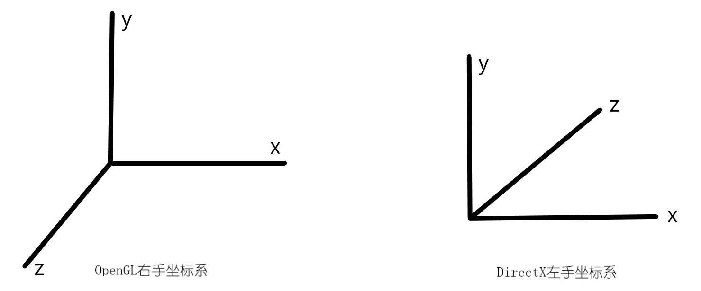

- OpenGL默认使用右手坐标系
- OpenGL默认使用列主序矩阵
- OpenGL归一化的CVV (*Canonical View Volume*)的z范围是[-1, 1]
- DirectX默认使用左手坐标系
- DirectX默认使用行主序矩阵
- DirectX归一化的CVV的z范围是[0, 1]
- (x, y, z, 0) 向量
- (x, y, z, 1) 点

- DirectX透视投影矩阵

  - P(x, y, z) => P’(x’, y’, z’), 
  - P`[N ${x\over z}$, N${y\over z}$, N], 投影后的x’和y’, 与z’不是线性关系, 与${1\over z'}$才是线性关系, 用${az+b\over z}$表示
  - z=N, ${az+b\over z}$=0
  - z=F, ${az+b\over z}$=1
  - 可得a=${F\over F-N}$, b=-${NF\over F-N}$
  - 反推投影矩阵, 可得
$$
\left[
 \begin{matrix}
   N & 0 & 0 & 0 \\
   0 & N & 0 & 0 \\
   0 & 0 & a & 1 \\
   0 & 0 & b & 0 \\
 \end{matrix} 
 \right]
$$
  - 给定x属于[a, b], 对应于y属于[c, d], 使得x与a的距离比上ab等于y与c的距离比上cd, 即${x-a\over b-a}$ = ${y-c\over d-c}$, 此时, [a, b]上任一点都能在[c, d]中找到对应点, 同理, 将(x’, y’)映射到[-1, 1] (线性插值), 可得
  - ${Nx/z - left\over right - left}$ = ${xcvv-(-1)\over 1-(-1)}$
  - ${Ny/z - bottom\over top - bottom}$ = ${ycvv-(-1)\over 1-(-1)}$
